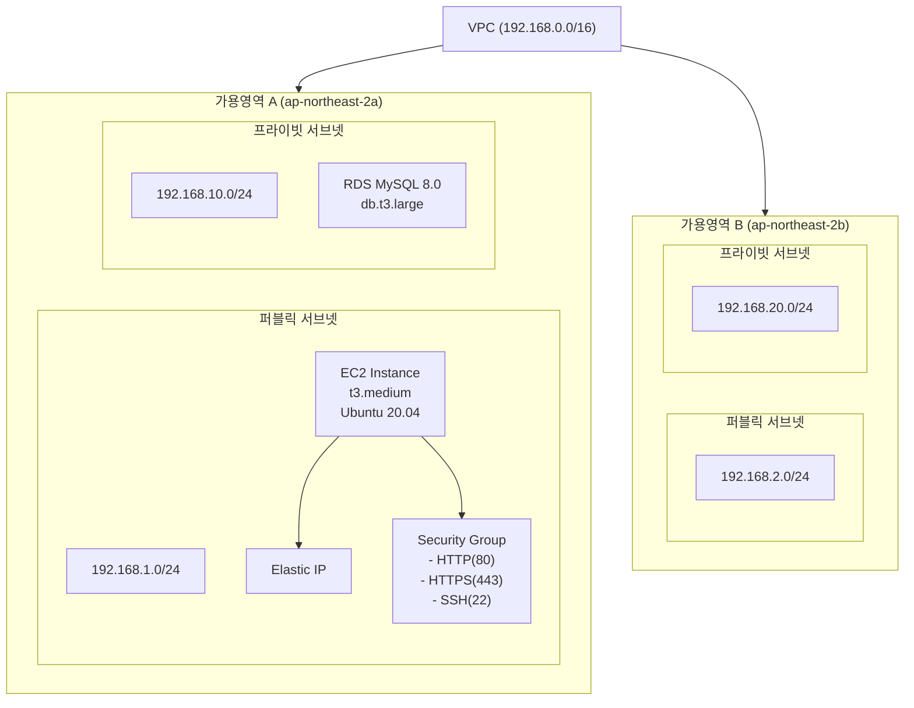

# 인프라 아키텍처 설계도

```mermaid
graph TD
    %% VPC 정의
    VPC["VPC (192.168.0.0/16)"]

    %% 가용영역 정의
    subgraph AZ1["가용영역 A (ap-northeast-2a)"]
        subgraph Public1["퍼블릭 서브넷"]
            PublicSubnet1["192.168.1.0/24"]
            EC2["EC2 Instance<br/>t3.medium<br/>Ubuntu 20.04"]
            EIP["Elastic IP"]
            SG["Security Group<br/>- HTTP(80)<br/>- HTTPS(443)<br/>- SSH(22)"]
        end

        subgraph Private1["프라이빗 서브넷"]
            PrivateSubnet1["192.168.10.0/24"]
            RDS["RDS MySQL 8.0<br/>db.t3.large"]
        end
    end

    subgraph AZ2["가용영역 B (ap-northeast-2b)"]
        subgraph Public2["퍼블릭 서브넷"]
            PublicSubnet2["192.168.2.0/24"]
        end

        subgraph Private2["프라이빗 서브넷"]
            PrivateSubnet2["192.168.20.0/24"]
        end
    end

    %% 연결 관계
    VPC --> AZ1
    VPC --> AZ2
    EC2 --> EIP
    EC2 --> SG
```
